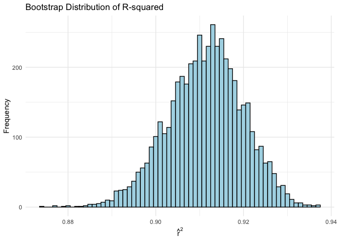
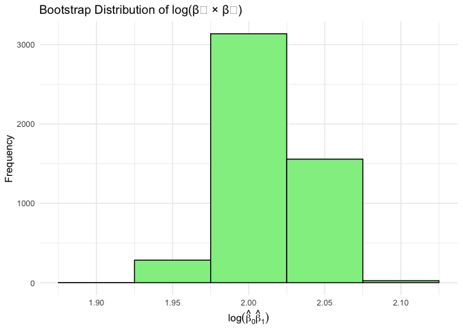
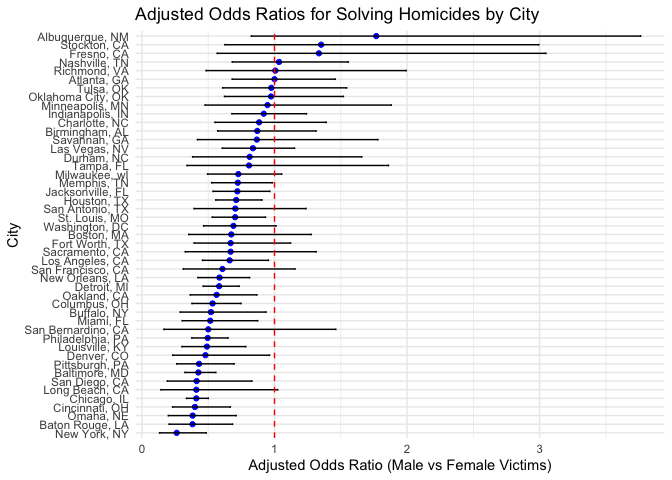
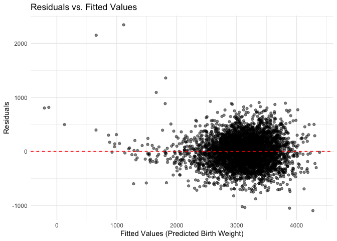

p8105_hw6_ys3875
================
Yanhao Shen
2024-11-27

``` r
library(tidyverse)
```

    ## ── Attaching core tidyverse packages ──────────────────────── tidyverse 2.0.0 ──
    ## ✔ dplyr     1.1.4     ✔ readr     2.1.5
    ## ✔ forcats   1.0.0     ✔ stringr   1.5.1
    ## ✔ ggplot2   3.5.1     ✔ tibble    3.2.1
    ## ✔ lubridate 1.9.3     ✔ tidyr     1.3.1
    ## ✔ purrr     1.0.2     
    ## ── Conflicts ────────────────────────────────────────── tidyverse_conflicts() ──
    ## ✖ dplyr::filter() masks stats::filter()
    ## ✖ dplyr::lag()    masks stats::lag()
    ## ℹ Use the conflicted package (<http://conflicted.r-lib.org/>) to force all conflicts to become errors

``` r
library(rnoaa)
```

    ## The rnoaa package will soon be retired and archived because the underlying APIs have changed dramatically. The package currently works but does not pull the most recent data in all cases. A noaaWeather package is planned as a replacement but the functions will not be interchangeable.

``` r
library(broom)
library(purrr)
library(janitor)
```

    ## 
    ## Attaching package: 'janitor'
    ## 
    ## The following objects are masked from 'package:stats':
    ## 
    ##     chisq.test, fisher.test

``` r
library(modelr)
```

    ## 
    ## Attaching package: 'modelr'
    ## 
    ## The following object is masked from 'package:broom':
    ## 
    ##     bootstrap

\##Q1.

``` r
weather_df = 
  rnoaa::meteo_pull_monitors(
    c("USW00094728"),
    var = c("PRCP", "TMIN", "TMAX"), 
    date_min = "2017-01-01",
    date_max = "2017-12-31") %>%
  mutate(
    name = recode(id, USW00094728 = "CentralPark_NY"),
    tmin = tmin / 10,
    tmax = tmax / 10) %>%
  select(name, id, everything())
```

    ## using cached file: /Users/shenyanhao/Library/Caches/org.R-project.R/R/rnoaa/noaa_ghcnd/USW00094728.dly

    ## date created (size, mb): 2024-11-27 12:23:53.721633 (8.667)

    ## file min/max dates: 1869-01-01 / 2024-11-30

``` r
bootstrap_sample <- function(data) {
  sample_data <- data |>
    sample_frac(size = 1, replace = TRUE)
  
  model <- sample_data |>
    lm(tmax ~ tmin, data = _)
  
  r_squared <- model |>
    glance() |>
    pull(r.squared)
  
  coefs <- model |>
    tidy()
  
  beta0 <- coefs |>
    filter(term == "(Intercept)") |>
    pull(estimate)
  
  beta1 <- coefs |>
    filter(term == "tmin") |>
    pull(estimate)
  
  log_beta0_beta1 <- log(beta0 * beta1)
  
  c(r_squared = r_squared, log_beta0_beta1 = log_beta0_beta1)
}

set.seed(1)
n_boot <- 5000

bootstrap_results <- replicate(n_boot, bootstrap_sample(weather_df))

bootstrap_results_df <- bootstrap_results |>
  t() |>
  as.data.frame() |>
  setNames(c("r_squared", "log_beta0_beta1"))

bootstrap_results_df |>
  ggplot(aes(x = r_squared)) +
  geom_histogram(binwidth = 0.001, color = "black", fill = "lightblue") +
  labs(
    title = "Bootstrap Distribution of R-squared",
    x = expression(hat(r)^2),
    y = "Frequency"
  ) +
  theme_minimal()
```

<!-- -->

``` r
bootstrap_results_df |>
  ggplot(aes(x = log_beta0_beta1)) +
  geom_histogram(binwidth = 0.05, color = "black", fill = "lightgreen") +
  labs(
    title = "Bootstrap Distribution of log(β₀ × β₁)",
    x = expression(log(hat(beta)[0] * hat(beta)[1])),
    y = "Frequency"
  ) +
  theme_minimal()
```

<!-- -->

``` r
r_squared_CI <- bootstrap_results_df$r_squared |>
  quantile(c(0.025, 0.975))

r_squared_CI
```

    ##      2.5%     97.5% 
    ## 0.8936684 0.9271060

``` r
log_beta0_beta1_CI <- bootstrap_results_df$log_beta0_beta1 |>
  quantile(c(0.025, 0.975))

log_beta0_beta1_CI
```

    ##     2.5%    97.5% 
    ## 1.964949 2.058887

\##Q2.

``` r
homicide_data <- read_csv("hw6_data/homicide-data.csv")
```

    ## Rows: 52179 Columns: 12
    ## ── Column specification ────────────────────────────────────────────────────────
    ## Delimiter: ","
    ## chr (9): uid, victim_last, victim_first, victim_race, victim_age, victim_sex...
    ## dbl (3): reported_date, lat, lon
    ## 
    ## ℹ Use `spec()` to retrieve the full column specification for this data.
    ## ℹ Specify the column types or set `show_col_types = FALSE` to quiet this message.

``` r
homicide_data <- homicide_data |>
  mutate(
    city_state = paste(city, state, sep = ", "),
    solved_binary = ifelse(disposition == "Closed by arrest", 1, 0),
    victim_age = as.numeric(victim_age)
  ) |>
  filter(
    !city_state %in% c("Dallas, TX", "Phoenix, AZ", "Kansas City, MO", "Tulsa, AL"),
    victim_race %in% c("Black", "White")
  )
```

    ## Warning: There was 1 warning in `mutate()`.
    ## ℹ In argument: `victim_age = as.numeric(victim_age)`.
    ## Caused by warning:
    ## ! NAs introduced by coercion

``` r
baltimore_data <- homicide_data |>
  filter(city_state == "Baltimore, MD")

baltimore_model <- baltimore_data |>
  glm(solved_binary ~ victim_age + victim_sex + victim_race, data = _, family = binomial)

baltimore_tidy <- baltimore_model |>
  tidy(conf.int = TRUE, exponentiate = TRUE)

or_sex <- baltimore_tidy |>
  filter(term == "victim_sexMale") |>
  select(term, estimate, conf.low, conf.high)

or_sex
```

    ## # A tibble: 1 × 4
    ##   term           estimate conf.low conf.high
    ##   <chr>             <dbl>    <dbl>     <dbl>
    ## 1 victim_sexMale    0.426    0.324     0.558

``` r
city_models <- homicide_data |>
  group_by(city_state) |>
  nest() |>
  mutate(
    model = map(data, ~ glm(solved_binary ~ victim_age + victim_sex + victim_race, data = .x, family = binomial))
  )

city_results <- city_models |>
  mutate(
    tidied = map(model, ~ tidy(.x, conf.int = TRUE, exponentiate = TRUE))
  ) |>
  unnest(tidied) |>
  filter(term == "victim_sexMale") |>
  select(city_state, estimate, conf.low, conf.high) |>
  filter(!is.na(estimate)) |>
  arrange(estimate) |>
  mutate(city_state = factor(city_state, levels = unique(city_state)))
```

    ## Warning: There were 45 warnings in `mutate()`.
    ## The first warning was:
    ## ℹ In argument: `tidied = map(model, ~tidy(.x, conf.int = TRUE, exponentiate =
    ##   TRUE))`.
    ## ℹ In group 1: `city_state = "Albuquerque, NM"`.
    ## Caused by warning:
    ## ! glm.fit: fitted probabilities numerically 0 or 1 occurred
    ## ℹ Run `dplyr::last_dplyr_warnings()` to see the 44 remaining warnings.

``` r
ggplot(city_results, aes(x = estimate, y = fct_reorder(city_state, estimate))) +
  geom_point(color = "blue") +
  geom_errorbarh(aes(xmin = conf.low, xmax = conf.high), height = 0.2) +
  geom_vline(xintercept = 1, linetype = "dashed", color = "red") +
  labs(
    title = "Adjusted Odds Ratios for Solving Homicides by City",
    x = "Adjusted Odds Ratio (Male vs Female Victims)",
    y = "City"
  ) +
  theme_minimal()
```

<!-- -->

There are some cities have OR close to 1, indicating there is no
difference between male and female in solving homicides. For those have
OR less than 1, like New York which have the lowest OR, suggests that
homicides involving male victims are less likely to be solved compared
to those involving female victims. We can see from the plot that, there
are only a few cities’ OR exceed 1, which leads the opposite conclusion
with those less than 1.

\##Q3.

``` r
birthweight <- read_csv("hw6_data/birthweight.csv") |>
  janitor::clean_names() |>
  mutate(
    babysex = factor(babysex, levels = c(1, 2), labels = c("Male", "Female")),
    frace = factor(frace),
    malform = factor(malform, levels = c(0, 1), labels = c("Absent", "Present")),
    mrace = factor(mrace)
  )
```

    ## Rows: 4342 Columns: 20
    ## ── Column specification ────────────────────────────────────────────────────────
    ## Delimiter: ","
    ## dbl (20): babysex, bhead, blength, bwt, delwt, fincome, frace, gaweeks, malf...
    ## 
    ## ℹ Use `spec()` to retrieve the full column specification for this data.
    ## ℹ Specify the column types or set `show_col_types = FALSE` to quiet this message.

``` r
missing_summary <- birthweight |>
  summarise(across(everything(), ~ sum(is.na(.)))) |>
  pivot_longer(cols = everything(), names_to = "variable", values_to = "missing_count")
missing_summary
```

    ## # A tibble: 20 × 2
    ##    variable missing_count
    ##    <chr>            <int>
    ##  1 babysex              0
    ##  2 bhead                0
    ##  3 blength              0
    ##  4 bwt                  0
    ##  5 delwt                0
    ##  6 fincome              0
    ##  7 frace                0
    ##  8 gaweeks              0
    ##  9 malform              0
    ## 10 menarche             0
    ## 11 mheight              0
    ## 12 momage               0
    ## 13 mrace                0
    ## 14 parity               0
    ## 15 pnumlbw              0
    ## 16 pnumsga              0
    ## 17 ppbmi                0
    ## 18 ppwt                 0
    ## 19 smoken               0
    ## 20 wtgain               0

``` r
#there is no missing value

model_full <- lm(bwt ~ babysex + bhead + blength + delwt+ fincome + frace + gaweeks + malform+ menarche+ momage +mheight +mrace +parity +pnumlbw+ pnumsga +ppbmi+ ppwt + wtgain + smoken, data = birthweight)
summary(model_full)
```

    ## 
    ## Call:
    ## lm(formula = bwt ~ babysex + bhead + blength + delwt + fincome + 
    ##     frace + gaweeks + malform + menarche + momage + mheight + 
    ##     mrace + parity + pnumlbw + pnumsga + ppbmi + ppwt + wtgain + 
    ##     smoken, data = birthweight)
    ## 
    ## Residuals:
    ##      Min       1Q   Median       3Q      Max 
    ## -1097.68  -184.86    -3.33   173.09  2344.15 
    ## 
    ## Coefficients: (3 not defined because of singularities)
    ##                  Estimate Std. Error t value Pr(>|t|)    
    ## (Intercept)    -6265.3914   660.4011  -9.487  < 2e-16 ***
    ## babysexFemale     28.7073     8.4652   3.391 0.000702 ***
    ## bhead            130.7781     3.4523  37.881  < 2e-16 ***
    ## blength           74.9536     2.0217  37.075  < 2e-16 ***
    ## delwt              4.1007     0.3948  10.386  < 2e-16 ***
    ## fincome            0.2898     0.1795   1.614 0.106551    
    ## frace2            14.3313    46.1501   0.311 0.756168    
    ## frace3            21.2361    69.2960   0.306 0.759273    
    ## frace4           -46.9962    44.6782  -1.052 0.292912    
    ## frace8             4.2969    74.0741   0.058 0.953745    
    ## gaweeks           11.5494     1.4654   7.882 4.06e-15 ***
    ## malformPresent     9.7650    70.6259   0.138 0.890039    
    ## menarche          -3.5508     2.8951  -1.226 0.220083    
    ## momage             0.7593     1.2221   0.621 0.534418    
    ## mheight            9.7874    10.3116   0.949 0.342588    
    ## mrace2          -151.4354    46.0453  -3.289 0.001014 ** 
    ## mrace3           -91.3866    71.9190  -1.271 0.203908    
    ## mrace4           -56.4787    45.1369  -1.251 0.210901    
    ## parity            95.5411    40.4793   2.360 0.018307 *  
    ## pnumlbw                NA         NA      NA       NA    
    ## pnumsga                NA         NA      NA       NA    
    ## ppbmi              4.3538    14.8913   0.292 0.770017    
    ## ppwt              -3.4716     2.6121  -1.329 0.183913    
    ## wtgain                 NA         NA      NA       NA    
    ## smoken            -4.8544     0.5871  -8.269  < 2e-16 ***
    ## ---
    ## Signif. codes:  0 '***' 0.001 '**' 0.01 '*' 0.05 '.' 0.1 ' ' 1
    ## 
    ## Residual standard error: 272.5 on 4320 degrees of freedom
    ## Multiple R-squared:  0.7183, Adjusted R-squared:  0.717 
    ## F-statistic: 524.6 on 21 and 4320 DF,  p-value: < 2.2e-16

``` r
q3_model <- lm(bwt ~ babysex + bhead + blength + delwt+ fincome + gaweeks +mrace +parity + smoken, data = birthweight)
```

I fitted all the variables to the model, and then filter out those with
large p value (\>0.05). then, I fitted my desired q3_model with the rest
variable.

``` r
birthweight_augmented <- birthweight |>
  add_predictions(model_full) |>
  add_residuals(model_full)

ggplot(birthweight_augmented, aes(x = pred, y = resid)) +
  geom_point(alpha = 0.5) +
  geom_hline(yintercept = 0, color = "red", linetype = "dashed") +
  labs(
    title = "Residuals vs. Fitted Values",
    x = "Fitted Values (Predicted Birth Weight)",
    y = "Residuals"
  ) +
  theme_minimal()
```

<!-- -->

``` r
model_1 <- lm(bwt ~ blength + gaweeks, data = birthweight)
model_2<- lm(bwt ~ bhead * blength * babysex,data = birthweight)

calculate_rmse <- function(model_formula, train_data, test_data) {
  train_data <- as_tibble(train_data)
  test_data <- as_tibble(test_data)

  model <- lm(model_formula, data = train_data)
  predictions <- predict(model, newdata = test_data)
  actuals <- test_data$bwt
  sqrt(mean((predictions - actuals)^2))
}

set.seed(123)
cv_samples <- crossv_mc(birthweight, n = 5)

rmse_results <- cv_samples |> 
  mutate(
    rmse_q3 = map2_dbl(train, test, ~ calculate_rmse(bwt ~ babysex + bhead + blength + delwt+ fincome + gaweeks +mrace +parity + smoken, .x, .y)),
    rmse_1 = map2_dbl(train, test, ~ calculate_rmse(bwt ~ blength + gaweeks, .x, .y)),
    rmse_2 = map2_dbl(train, test, ~ calculate_rmse(bwt ~ bhead * blength * babysex, .x, .y))
  )

rmse_summary <- rmse_results |> 
  select(starts_with("rmse")) |> 
  pivot_longer(
    cols = everything(),
    names_to = "model",
    values_to = "rmse"
  ) |> 
  group_by(model) |> 
  summarise(mean_rmse = mean(rmse, na.rm = TRUE))

rmse_summary
```

    ## # A tibble: 3 × 2
    ##   model   mean_rmse
    ##   <chr>       <dbl>
    ## 1 rmse_1       342.
    ## 2 rmse_2       290.
    ## 3 rmse_q3      278.

Based on the mean rmse, we can conclude that model_q3 has the lowest
mean rmse, and thus it performs the best, reflecting its comprehensive
set of predictors.
